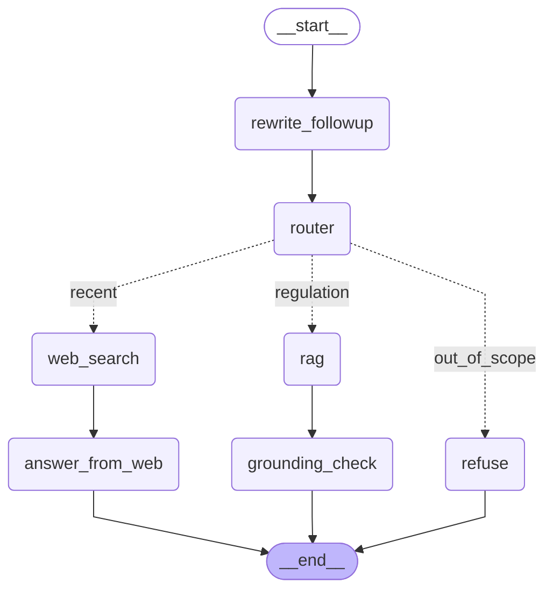

# SebiSage

Agentic RAG over five Indian SEBI securities regulations — LODR, PIT, SAST, IA, and RA — answering questions with clause-level citations (e.g. `lodr_2015.pdf:regulation 38`) instead of free-floating prose.

**Disclaimer**: this is a portfolio/demo project, not legal advice. Answers are grounded in the regulation text retrieved by the system, but always verify against the primary source before relying on them.

## Status

Built and verified end-to-end locally (Docker build/run, full test suite, CI). **Not currently deployed to a public URL** — the original plan (Hugging Face Spaces free tier) turned out to require a paid plan on the account used to build this, and the fallback (Oracle Cloud Always Free) needs a card on file for identity verification, which wasn't available. Real memory testing under load (~793.5MiB peak, see `HUMAN_GUIDE.md` Phase 9) shows the app is well within reach of most free tiers once one is accessible. The image itself is 3.28GB (down from 3.6GB after moving model downloads to container startup and trimming an offline-only dependency) — getting it under 1GB would need swapping out torch/Chroma/Streamlit for lighter alternatives, a real architecture change rather than a packaging tweak, so it wasn't pursued. The image is Docker-ready and CI-verified, just not hosted. See [Run locally](#run-locally) to try it yourself.

## Architecture



`router` is 3-tier and cost-ordered: free keyword rules first, then a retrieval-confidence fast path, and only falls back to an LLM classifier when both are inconclusive. `rag` reuses the router's already-computed retrieval rather than paying for hybrid retrieval + reranking twice. Regenerate this diagram with `python scripts/export_agent_graph.py`.

Retrieval pipeline (the `rag` node): structure-aware chunking → dense (Chroma + `bge-small-en-v1.5`) and BM25 retrieval fused via Reciprocal Rank Fusion → cross-encoder rerank (`ms-marco-MiniLM-L-6-v2`) → citation-forcing generation → grounding validator (flags uncited/hallucinated claims, one auto-retry).

## Results

All numbers below are copied directly from `reports/` — see `reports/EVAL_REPORT.md` and `reports/retrieval_ablation_dev.json` for the source data.

### Retrieval ablation (dev set, n=34)

| Config | Chunker | Retrieval | Rerank | Recall@1 | Recall@5 | MRR@10 | p50 latency |
|---|---|---|---|---|---|---|---|
| A | fixed | dense only | no | 45.2% | 83.9% | 0.600 | 64.2ms |
| B | structured | dense only | no | 61.3% | 93.5% | 0.756 | 61.9ms |
| C | structured | BM25 only | no | 38.7% | 67.7% | 0.519 | 39.4ms |
| D | structured | hybrid (RRF) | no | 45.2% | 87.1% | 0.616 | 125.3ms |
| **E** | **structured** | **hybrid (RRF)** | **yes** | **64.5%** | **87.1%** | **0.762** | 4059.7ms |

Config E (structured chunking + hybrid RRF + cross-encoder rerank) was selected as the production config on dev MRR@10, then run once on test:

| Metric | Test (n=23) |
|---|---|
| Recall@1 | 61.9% |
| Recall@3 | 85.7% |
| Recall@5 | 90.5% |
| MRR@10 | 0.747 |

### End-to-end (test set, n=23)

| Metric | Value |
|---|---|
| Router accuracy | 100% |
| Refusal precision / recall (n=2 out-of-scope) | 100% / 100% |
| Grounding pass rate (regulation-routed, n=21) | 100% |
| Mean tokens in / out | 898.6 / 63.8 |
| Mean estimated cost per query | $0.00032 |

Reranking is real cross-encoder cost, not a synthetic number — it scales with candidate-set size and is the dominant latency cost in config E (4.06s p50 vs 62-125ms for the non-reranked configs). Worth it here for the retrieval-quality gain, but the tradeoff is explicit.

## Design decisions

- **Structure-aware chunking over fixed-size**: a regex-based parser detects regulation/sub-regulation/clause boundaries (with strict-increasing validation to catch false matches) instead of splitting on token windows. This is what makes clause-level citations possible at all — a fixed-size chunk has no natural `regulation_no` to cite. Ablation confirms it also improves retrieval quality on its own (config A vs B, dense-only: Recall@5 83.9% → 93.5%).
- **Hybrid retrieval (dense + BM25 via RRF), not dense alone**: regulation text has exact-phrase and defined-term queries (e.g. "material subsidiary") where sparse lexical matching outperforms embeddings alone, alongside paraphrased queries where dense wins. RRF fuses both without needing to hand-tune a blend weight.
- **Cross-encoder reranking as a final stage, not the primary retriever**: reranking every chunk in the corpus would be too slow; reranking the top-K fused candidates gets most of the quality gain (MRR@10 0.616 → 0.762) at a fixed, bounded cost.
- **A grounding validator with one retry, not a single generation pass**: forcing citations in the prompt doesn't guarantee the model doesn't hallucinate one. The validator checks every cited source is real and every claim traces to a citation, and retries generation once if it fails, rather than silently returning an uncited answer.
- **A 3-tier cost-ordered router, not an LLM classifier on every query**: free keyword rules and a retrieval-confidence fast path handle most queries; the LLM classifier only runs when both are inconclusive, keeping routing cost near zero on the common path.
- **Local embeddings and reranker (not an API) plus a disk cache on every LLM call**: keeps the retrieval path free and fast, and means reruns of eval scripts during development cost zero LLM quota — cache hit rate on the recorded eval run was checked and reported, not assumed (see `reports/EVAL_REPORT.md`).

## Run locally

Requires Python 3.11 and a Gemini API key (free tier). Langfuse and EvalForge keys are optional — tracing and EvalForge scoring both no-op cleanly without them.

```bash
git clone https://github.com/Som0111/sebisage.git
cd sebisage
python -m venv .venv && source .venv/bin/activate   # .venv\Scripts\activate on Windows
pip install torch --index-url https://download.pytorch.org/whl/cpu
pip install -e ".[dev]"

# .env in the repo root:
#   GEMINI_API_KEY=...
#   SEBISAGE_API_KEY=any-long-random-string
#   LANGFUSE_PUBLIC_KEY=...   (optional)
#   LANGFUSE_SECRET_KEY=...   (optional)
#   LANGFUSE_HOST=...         (optional)

# build indexes from the committed data/processed/ chunks (derived public regulation text)
python scripts/build_index.py --chunker all

# run the API
uvicorn sebisage.api:app --app-dir src --host 0.0.0.0 --port 8000

# in a second terminal, run the UI
streamlit run ui/app.py --server.port 7860

# run the full eval suite
python scripts/run_eval.py

# run tests
pytest -q
```

Or with Docker (builds indexes at image-build time, not on first request):

```bash
docker build -t sebisage .
docker run -p 8000:8000 -p 7860:7860 --env-file .env sebisage
```

## API reference

All endpoints except `/health` require an `X-API-Key` header matching `SEBISAGE_API_KEY`.

| Method | Path | Description |
|---|---|---|
| GET | `/health` | Liveness + baked-in index stats. No auth. |
| POST | `/ask` | Ask a question, get the full grounded answer with citations in one response. |
| POST | `/ask/stream` | Same, streamed via SSE (full answer is computed first so grounding-retry can run, then streamed token by token — not raw token streaming). |
| GET | `/sources/{chunk_id}` | Fetch the full text of a cited chunk. |
| GET | `/stats` | Aggregate usage/cost stats for this server process. |

## Honest limitations

- One PIT regulation (regulation 14) is missed by the structure-aware chunker due to a nested-bracket amendment pattern the regex doesn't handle — a known, accepted gap, not silently swallowed.
- Reranking (config E) adds ~4s p50 latency versus non-reranked retrieval; this is real cross-encoder cost, not a bug, and was a deliberate quality/latency tradeoff.
- EvalForge's LLM-judge scores are a secondary signal only — EvalForge's own inter-annotator kappa for its judge was low on this eval; rule-based and embedding scores are treated as primary (see `reports/EVAL_REPORT.md`).
- Not currently deployed to a public URL (see [Status](#status)).
- Sessions are in-memory only (no persistent chat history across server restarts).

## Roadmap / future work

- Query decomposition for questions spanning two regulations.
- LoRA fine-tune the embedding model on regulation Q&A pairs and measure the gain.
- Deploy once a free tier without a card requirement is accessible, or on paid infra.
- Add a second human annotator to the eval set and measure inter-annotator agreement.
