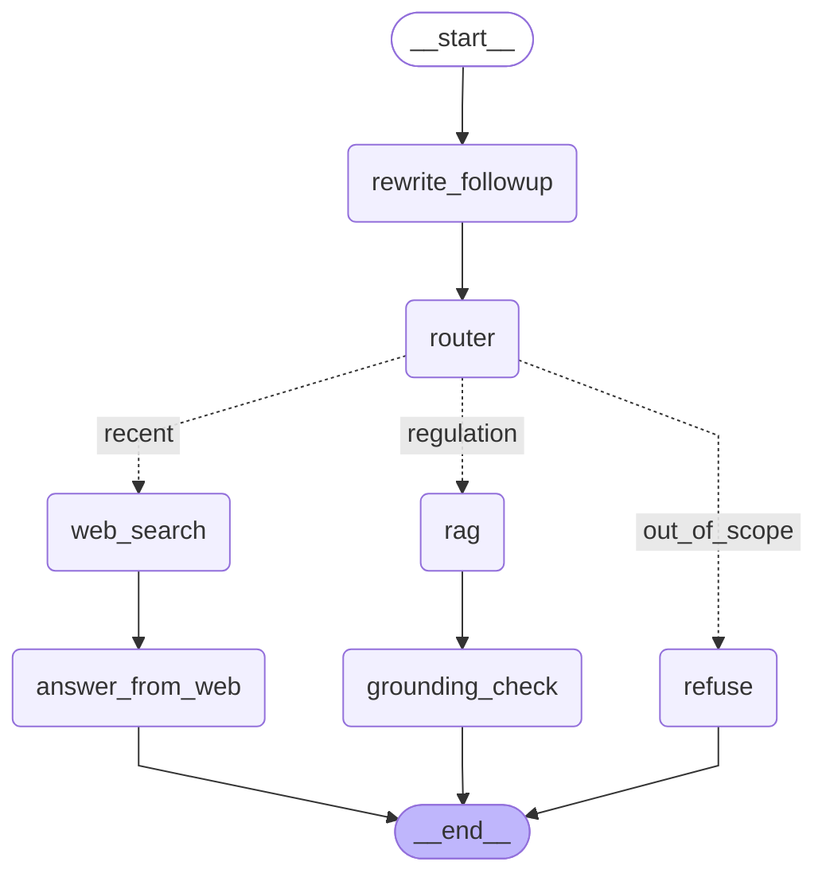

# SebiSage Agent Graph

```mermaid
---
config:
  flowchart:
    curve: linear
---
graph TD;
	__start__([<p>__start__</p>]):::first
	rewrite_followup(rewrite_followup)
	router(router)
	rag(rag)
	grounding_check(grounding_check)
	web_search(web_search)
	answer_from_web(answer_from_web)
	refuse(refuse)
	__end__([<p>__end__</p>]):::last
	__start__ --> rewrite_followup;
	rag --> grounding_check;
	rewrite_followup --> router;
	router -. &nbsp;regulation&nbsp; .-> rag;
	router -. &nbsp;out_of_scope&nbsp; .-> refuse;
	router -. &nbsp;recent&nbsp; .-> web_search;
	web_search --> answer_from_web;
	answer_from_web --> __end__;
	grounding_check --> __end__;
	refuse --> __end__;
	classDef default fill:#f2f0ff,line-height:1.2
	classDef first fill-opacity:0
	classDef last fill:#bfb6fc
```
